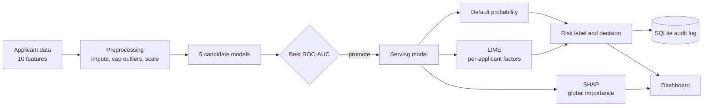

# CreditTrust AI — Explainable Loan Default Prediction


**CreditTrust AI predicts whether a loan applicant is likely to default, and explains *why*.**

It trains five machine-learning models, automatically promotes the best one, explains every decision in two ways (SHAP for the overall picture, LIME for a single applicant), and records each decision in an audit database. One FastAPI application serves both the prediction API and the web dashboard.

> **Why this matters:** in lending, a bare "rejected" is not acceptable. Loan officers, regulators and applicants all need to know which factors drove a decision. This project is built around that need.

---

## Highlights

- **Five models compared fairly:** Logistic Regression, Decision Tree, Random Forest, XGBoost and SVM, all tested on the same held-out data.
- **Automatic model promotion:** the model with the best ROC-AUC is served. Nothing is hardcoded.
- **Two levels of explanation:** SHAP shows which features matter across all applicants; LIME shows what drove one applicant's score.
- **Plain-language output:** every prediction comes with a readable explanation, not just a number.
- **Human-in-the-loop:** high-risk applicants are referred for manual review instead of being auto-rejected.
- **Audit trail:** every prediction is logged to SQLite with its inputs, model, probability and top factors.
- **Same preprocessing everywhere:** training and live prediction share one function, so they cannot drift apart.
- **Single process:** FastAPI serves the models and the dashboard together.

---

## How it works



**Training** (`python -m app.ml.train`)
1. Load the dataset (the real Kaggle file if present, otherwise a synthetic one with the same schema).
2. Split 80/20 with stratification.
3. Fit preprocessing on the training split only: median imputation, outlier capping at the 99.5th percentile, scaling.
4. Train and evaluate all five models.
5. Promote the best model by ROC-AUC and compute its global SHAP importance.

**Prediction** (`POST /api/predict`)
1. Validate the request.
2. Apply the same preprocessing used in training.
3. Score with the promoted model.
4. Probability of **0.40 or higher** means *High Risk, refer for manual review*; below that means *Approved / Low Risk*.
5. Generate LIME factors and a plain-language explanation.
6. Log the result to SQLite and return it.

---

## Tech stack

| Layer | Technology |
|---|---|
| API | FastAPI, Uvicorn, Pydantic v2 |
| Machine learning | scikit-learn, XGBoost, pandas, NumPy, joblib |
| Explainability | SHAP, LIME |
| Database | SQLite (standard library, no ORM) |
| Frontend | HTML, CSS, JavaScript, Chart.js |

---

## Project structure

```
.
├── backend/
│   ├── app/
│   │   ├── main.py            # FastAPI app: API routes + serves the frontend
│   │   ├── inference.py       # Loads the promoted model; predict + LIME + explanation
│   │   ├── database.py        # SQLite schema and audit-log queries
│   │   ├── schemas.py         # Request / response models
│   │   └── ml/
│   │       ├── data.py        # Real dataset loader or synthetic stand-in
│   │       ├── preprocess.py  # Impute, cap, scale (shared by training and inference)
│   │       ├── train.py       # Trains 5 models, evaluates, promotes the best
│   │       └── explain.py     # SHAP (global) and LIME (local)
│   ├── models/                # Trained models and metrics
│   ├── data/                  # Optional: place the real Kaggle CSV here
│   └── requirements.txt
├── frontend/
│   └── index.html             # Dashboard: Overview, Explainability, Try a Prediction
├── LOGIC_WALKTHROUGH.md       # File-by-file tour of the pipeline
└── README.md
```

---

## Getting started

**Requirements:** Python 3.10 or newer.

```bash
# 1. Clone the repository
git clone https://github.com/aaryadamera/ALT-Team2-project-working.git
cd ALT-Team2-project-working/backend

# 2. Create and activate a virtual environment
python -m venv venv
source venv/bin/activate        # Windows: venv\Scripts\activate

# 3. Install dependencies
pip install -r requirements.txt

# 4. (Optional) Retrain the models, about 1-2 minutes
python -m app.ml.train

# 5. Start the application
uvicorn app.main:app --reload
```

When the server starts, Uvicorn prints the address it is running on. Open that address in your browser to use the dashboard, and add `/docs` to it for the interactive API documentation.

Pre-trained models are included in `backend/models/`, so step 4 is optional. The dashboard only works while the server is running on your own machine.

---

## Dataset

The project uses the schema of the Kaggle **Give Me Some Credit** dataset: 10 applicant features and one target.

By default it generates a **synthetic dataset** with the same schema (about 150,000 rows, roughly 7.6% defaults, with missing values and outliers) so everything runs without a download.

To train on the real data:
1. Download **Give Me Some Credit** from Kaggle.
2. Save the training file as `backend/data/cs-training.csv` with its original column names.
3. Run `python -m app.ml.train`. The real file is detected automatically.

| Feature | Meaning |
|---|---|
| `RevolvingUtilizationOfUnsecuredLines` | Share of available revolving credit in use |
| `age` | Applicant age |
| `NumberOfTime30-59DaysPastDueNotWorse` | Times 30-59 days past due |
| `NumberOfTime60-89DaysPastDueNotWorse` | Times 60-89 days past due |
| `NumberOfTimes90DaysLate` | Times 90+ days late |
| `DebtRatio` | Monthly debt payments relative to income |
| `MonthlyIncome` | Monthly income |
| `NumberOfOpenCreditLinesAndLoans` | Open loans and credit lines |
| `NumberRealEstateLoansOrLines` | Mortgage and real-estate loans |
| `NumberOfDependents` | Number of dependents |

Target: `SeriousDlqin2yrs` (1 means serious delinquency within two years).

---

## Dashboard

| Tab | What it shows |
|---|---|
| **Overview** | Model leaderboard (accuracy, precision, recall, F1, ROC-AUC), a ROC-AUC chart, and a tag on the promoted model |
| **Explainability** | Global SHAP feature-importance ranking |
| **Try a Prediction** | Enter an applicant (or load a sample) to get the probability, risk badge, ranked factors and a plain-language explanation |

<!-- Add screenshots once you have them:


-->

---

## API

| Method | Endpoint | Purpose |
|---|---|---|
| `GET` | `/api/health` | Status, promoted model, dataset info |
| `GET` | `/api/leaderboard` | Metrics for all five models |
| `GET` | `/api/shap/global` | Global SHAP feature importance |
| `POST` | `/api/predict` | Score one applicant, explain it, log it |
| `GET` | `/api/predictions/recent` | Recent entries from the audit log |

**Example request body for `POST /api/predict`:**

```json
{
  "applicant_name": "Jane Doe",
  "age": 41,
  "monthly_income": 5200,
  "revolving_utilization": 0.85,
  "debt_ratio": 0.62,
  "open_credit_lines": 9,
  "real_estate_loans": 1,
  "dependents": 2,
  "late_30_59_days": 2,
  "late_60_89_days": 1,
  "late_90_plus_days": 1
}
```

**The response contains:** `model_used`, `default_probability`, `risk_label`, `decision`, `top_factors` (ranked LIME factors) and `explanation_text`.

**Inspect the audit log:**

```bash
sqlite3 credittrust.db "SELECT id, applicant_name, model_name, default_probability, risk_label FROM predictions ORDER BY id DESC LIMIT 5;"
```

---

## Results

Evaluated on a held-out test set of 30,000 rows, with class imbalance handled through class weighting.

| Model | Accuracy | Precision | Recall | F1 | ROC-AUC |
|---|---|---|---|---|---|
| Logistic Regression | 89.6% | 41.5% | 89.1% | 56.6% | 0.943 |
| Decision Tree | 91.8% | 48.1% | 87.5% | 62.1% | 0.939 |
| **Random Forest (promoted)** | 92.3% | 49.7% | 87.8% | 63.5% | **0.945** |
| XGBoost | 92.4% | 50.0% | 87.4% | 63.6% | 0.942 |
| SVM (RBF) | 92.6% | 50.8% | 84.4% | 63.4% | 0.925 |

> **Note:** these results come from the bundled **synthetic** dataset. They show that the pipeline works, not how it would perform on real borrowers. Retrain on the real Kaggle data for meaningful numbers.

Recall is high, so the system catches most true defaulters, while precision is lower, so many flagged applicants would not have defaulted. That is a deliberate trade-off for a screening tool, which is why flagged applicants go to manual review rather than automatic rejection.

---

## Design decisions

- **One preprocessing function** is used for both training and serving, which removes train/serve mismatch.
- **Preprocessing is fitted on the training split only**, so no test information leaks in.
- **SHAP for global, LIME for local**, because they answer different questions.
- **Plain `sqlite3` with no ORM**, so the audit layer is easy to read and explain.
- **Fallbacks** keep the app running if `shap`, `lime` or `xgboost` are missing.
- **Fail fast:** the API refuses to start until the models have been trained.

---

## Limitations

- Not intended for real lending decisions. There is no fairness or bias auditing and no regulatory review.
- The default data is synthetic, so metrics and feature rankings reflect the generator, not real borrowers.
- The SVM is trained on an 8,000-row subsample for speed, so its scores are not directly comparable.
- Global SHAP importance is computed on a 2,000-row sample.
- There is no authentication or rate limiting, and CORS is open. Tighten both before any real deployment.
- Applicant data is stored in plain SQLite. Add access controls before using real personal data.

---

## Future work

- Probability calibration and a cost-based decision threshold
- Fairness analysis across demographic groups
- Counterfactual explanations ("what would change this decision?")
- Authentication and rate limiting
- Docker and CI with automated tests
- Model versioning and drift monitoring

---

## Further reading

See [`LOGIC_WALKTHROUGH.md`](LOGIC_WALKTHROUGH.md) for a guided tour of where each pipeline stage lives in the code.

---
